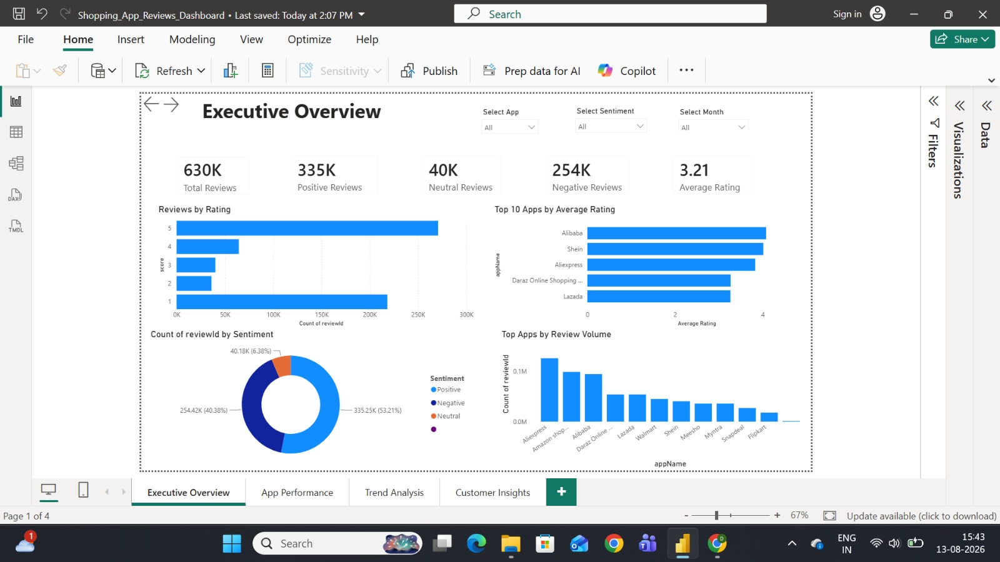
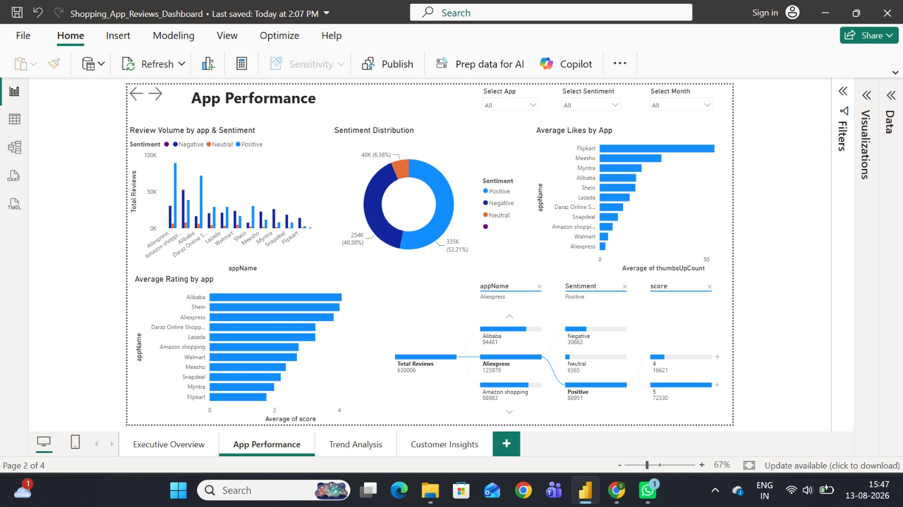
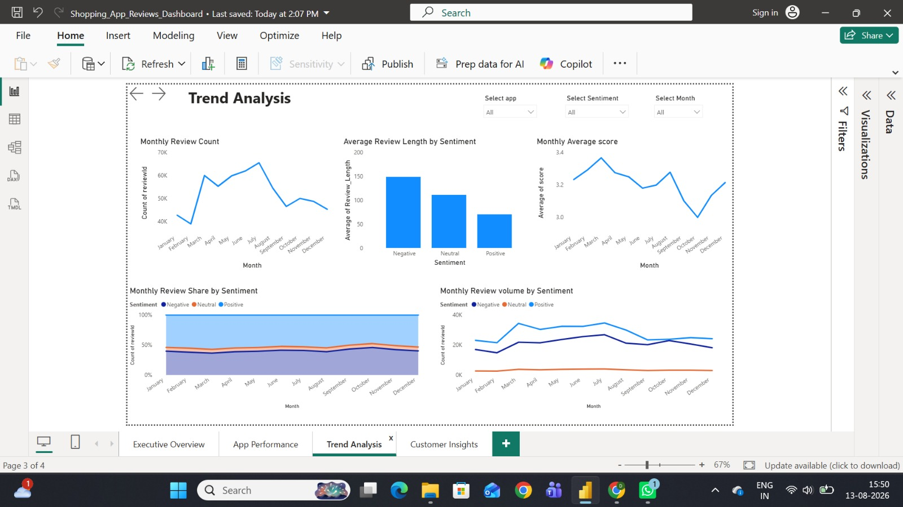
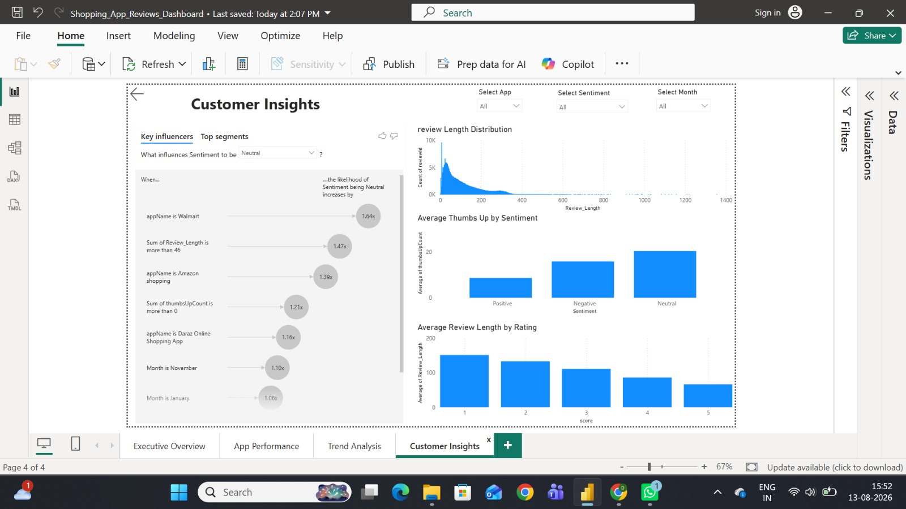

# shopping-app-reviews-powerbi-dashboard
End-to-end data analytics project using Python for data cleaning and Power BI for interactive dashboard visualization of shopping app reviews, sentiment, ratings, and customer insights.

## 📌 Project Overview

This project analyzes customer reviews of shopping applications using **Python for data cleaning** and **Microsoft Power BI for interactive data visualization**.

The dashboard provides insights into customer ratings, sentiment, app performance, review trends, customer engagement, and review behavior.

## 🛠️ Tools & Technologies

- **Python**
- **Pandas**
- **Jupyter Notebook**
- **Microsoft Power BI**
- **DAX**

## 🔄 Project Workflow

1. Collected and prepared the review data.
2. Cleaned and transformed the data using Python and Pandas.
3. Prepared the cleaned data for analysis.
4. Built an interactive Power BI dashboard.
5. Created measures and calculations using DAX.
6. Analyzed customer sentiment, ratings, app performance, trends, and engagement.

# 📊 Dashboard Pages

## 1. Executive Summary

Provides an overall view of customer reviews and app performance.

### Key insights

- Total Reviews
- Average Rating
- Positive Reviews
- Negative Reviews
- Neutral Reviews
- Reviews by Rating
- Top 10 Apps by Average Rating
- Review Distribution by Sentiment
- Top Apps by Review Volume

### Dashboard Preview



## 2. App Performance Analysis

Compares shopping applications based on reviews, ratings, sentiment, and customer engagement.

### Key insights

- Review Volume by App & Sentiment
- Sentiment Distribution
- Average Likes by App
- Average Rating by App
- App Performance Analysis

### Dashboard Preview



## 3. Review Trends & Sentiment

Analyzes customer review patterns and sentiment over time.

### Key insights

- Monthly Review Volume
- Monthly Average Rating
- Review Length by Sentiment
- Monthly Sentiment Trends
- Review Trends Over Time

### Dashboard Preview



## 4. Customer Sentiment & Insights

Provides deeper insights into customer behavior and review characteristics.

### Key insights

- Key Influencers
- Review Length Distribution
- Average Thumbs Up by Sentiment
- Average Review Length by Rating

### Dashboard Preview

)

# 🎯 Key Skills Demonstrated

- Data Cleaning
- Data Transformation
- Python & Pandas
- Exploratory Data Analysis
- Power BI
- DAX
- Data Visualization
- Sentiment Analysis
- Customer Analytics
- Dashboard Design
- Business Intelligence
- Data Storytelling

# 📂 Repository Contents

```text
shopping-app-reviews-powerbi-dashboard/
│
├── README.md
│
├── python/
│   └── data_cleaning.ipynb
│
└── screenshots/
    ├── executive_summary.png
    ├── app_performance_analysis.png
    ├── review_trends_sentiment.png
    └── customer_sentiment_insights.png
